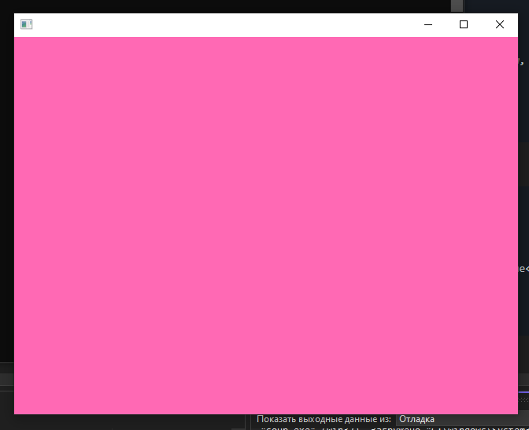

# Класс `LevelManager`

Позволяет хранить и перемещаться между уровнями.

Тест: [tests/level-manager.cpp](../../src/engine/tests/level-manager.cpp)

## Методы
Добавляет новую карту, которая наследует класс `Level`, в хралищие карт. 

Возвращает `true` при успешном добавлении.
```cpp
inline bool addLevel(const std::string& name, std::unique_ptr<Level> level)
```

Возвращает сырой указатель при условии, что указанная карта существует в хранилище карт.
```cpp
inline Level* getLevel(const std::string& name)
```

Удаляет существующую карту из хранилища. Если указатель был ранее на этой карте - указатель становится nullptr.

Возвращает `true` при успешном удалении.

```cpp
inline bool removeLevel(const std::string& name)
```

Устанавливает указатель на новую карту. Возвращает `true` при успешной смене. 
```cpp
inline bool setLevel(const std::string& name)
```

Отрисовывает каждый кадр выбранную локацию.
```cpp
inline void update(sf::RenderWindow& window, sf::Event& event)
```

### Пример кода

level1.hpp:
```cpp
#pragma once

#include <levels/level.hpp>

class GameMap1 : public Level {
  public:
    inline void update(sf::RenderWindow& window, sf::Event& event) override {
      window.clear(sf::Color(255, 105, 180));
      window.display();
    };
};
```
game.hpp:
```cpp
#include "game.hpp"
#include "level1.hpp"

void Game::init(void) {
  if (level->addLevel("level1", std::make_unique<GameMap1>())) {
    level->setLevel("level1");
  };
};
```
**Результат**:

