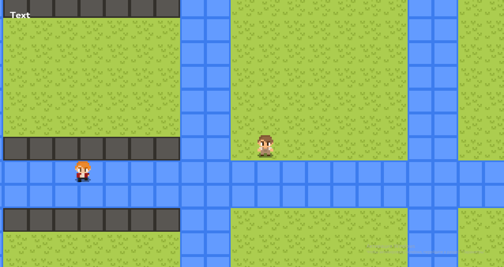

# 🍲 Delicious Soup


<p align="center" style="font-size:12px">Unfinished work, the screenshot does not represent the final game <br> (screenshot by 08/03/2025)</p>
<br>

Delicious Soup is a simple 2D simulation game owner of a street restaurant. You need to cook and fulfill customer orders.
\
\
**Project Status**: in active development.

> [!NOTE]  
> This application is a learning exercise. Consequently, some implementation choices may reflect that learning process rather than production-grade best practices.

## 🎮 Game mechanics

- [X] Player (movement, interaction)
- [X] User Interface (pause, hud, kitchen menu)
- [X] Entity (player, npc, builds)
- [ ] Cooking (*in progress*)
- [ ] Orders (*in plans*)
- [X] Events (repetitive, single)
- [ ] Changing scenes (*in plans*)
- [ ] Save / Load (*in plans*)
- [ ] Music / Sounds (*in plans*)

## ⚙️ Using libraries

- **[SFML v2.6.2](https://github.com/SFML/SFML/tree/2.6.2)**: window, graphic, audio
- **[Catch2 v3.5.0](https://github.com/catchorg/Catch2/tree/v3.5.0)**: unit tests

## 🛠️ Used tools

- **[Visual Studio 2022](https://visualstudio.microsoft.com/vs/)**: code, debugging
- **[CMake](https://cmake.org/)**: building a project
- **[Aseprite](https://aseprite.org/)**: drawing a game graphic
- **[Fl Studio 12](https://www.image-line.com/)**: sampling, music, sfx

## 📦 Install

Clone this repository on your system via **[GIT](https://git-scm.com/downloads)**.

```bash
git clone https://github.com/levalyukov/game-cpp.git
cd game-cpp
```

To make the project work, install the submodules:

```bash
git submodule update --init
```

For building this game you need **[CMake](https://cmake.org/download/)** v3.15 and high:

```bash
mkdir build
cd build

cmake ..
make

./main
```

## 📜 License

The repository is licensed by **[MIT](license)**.
